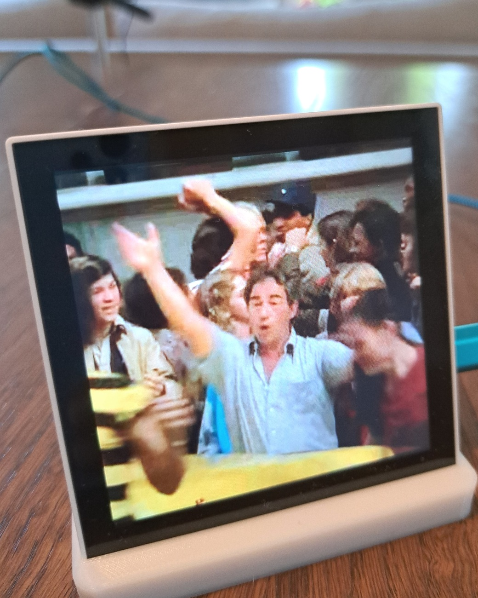
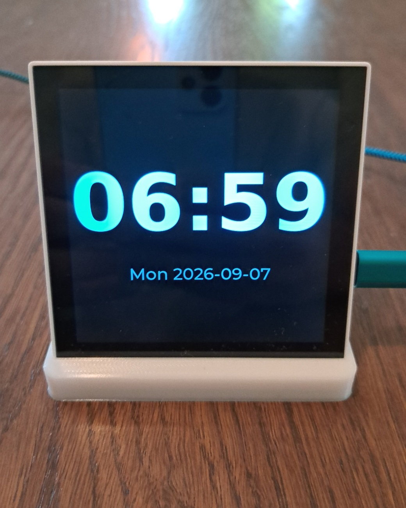
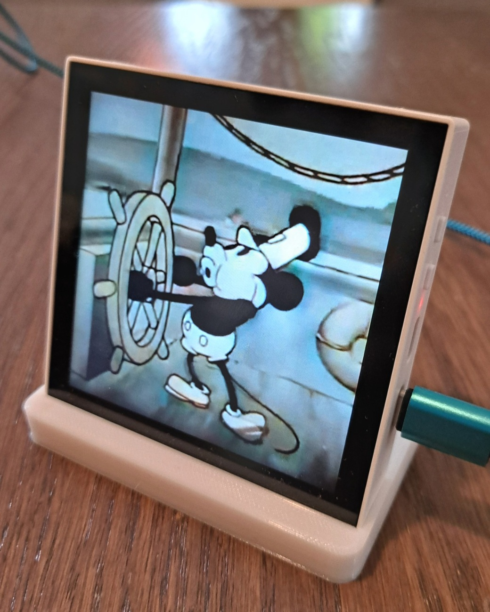

<p align="center">
  
  &nbsp;&nbsp;
  
  &nbsp;&nbsp;
  
</p>

<h1 align="center">Video Alarm Clock</h1>

<p align="center">
  A bedside clock that wakes you with your own video instead of a beep.
</p>

<p align="center">
  <strong>720×720 touch screen</strong> ·
  <strong>built-in speaker</strong> ·
  <strong>power-cut-safe alarms</strong> ·
  <strong>Wi-Fi updates</strong>
</p>

---

Video Alarm Clock runs on a [Waveshare ESP32-P4 touch display](https://www.waveshare.com/esp32-p4-wifi6-touch-lcd-4b.htm) and plays
videos from a microSD card. Flash it once, put it on Wi-Fi, add your
media, and manage alarms from the device itself.

This repository has **the installation files and procedure**. It has the three things you need
to own one:

| Directory | What it gives you |
| --- | --- |
| [`firmware/`](firmware/) | The firmware binaries and one-command installer |
| [`video/`](video/) | A container that converts and uploads video files |
| [`enclosure/`](enclosure/) | The printable bedside stand |

Once the firmware is on, the clock updates itself over Wi-Fi: gear icon
→ **About** → **Check for updates**. You should only need the cable
once.

---

## What you need

**Hardware**

- A **Waveshare ESP32-P4-WIFI6-Touch-LCD-4B** — 720×720 MIPI-DSI panel,
  GT911 touch, ES8311 audio codec, 32 MB flash, 32 MB PSRAM. 
  see: [https://www.waveshare.com/esp32-p4-wifi6-touch-lcd-4b.htm]

  **The board this has been tested on carries an ESP32-P4 revision
  v1.3.** The firmware is built for revisions v1.00 through v1.99, so
  other v1.x parts should work, but v1.3 is the only one it has actually
  run on. If
  you have a different revision and it works — or does not — that is
  worth reporting. A board the firmware refuses says so plainly while
  flashing: *"requires chip revision in range ... this chip is revision
  ..."*.
- A **USB-C cable** to the board's UART port.
- A **microSD card**, formatted **FAT32**. Video lives here, not in
  flash; 32 GB is plenty, 128 GB is generous.

**On your computer**

- Linux or macOS for the firmware install below. Converting video also
  works on **Windows**, with Docker Desktop — step by step in
  [`video/README.md`](video/README.md#on-windows-step-by-step).
- `esptool`, only if you install the firmware from a terminal:
  `pip install --user esptool`. The browser installer in step 1 needs
  nothing at all.
- Docker, if you want the video container. Otherwise `ffmpeg` directly,
  plus `yt-dlp` only if you want the YouTube shortcut — see
  [`video/README.md`](video/README.md).

---

## 1. Install the firmware

Plug the board into your computer by its **UART** port — not the OTG
one. Then either press this:
<br><br>

<div align="center">
  <a href="https://brunokeymolen.github.io/videoalarmclock/">
    
  </a>
</div>

<br><br>
It flashes the board from the page it opens, with nothing to install
first. It needs Chrome, Edge or Firefox 151+ on a desktop — Safari and
iOS have no Web Serial at all and cannot do this.

Or from a terminal, which works everywhere:

```sh
cd firmware
./flash.sh
```

On Linux the board appears as `/dev/ttyACM0`.

That downloads the newest release, checks it against the published
checksum, and writes it. It takes about half a minute and ends with the
board resetting into the clock face.

Pick a specific version, or a specific port, if you need to:

```sh
./flash.sh --version v0.2.0
./flash.sh --port /dev/ttyACM0
```

<details>
<summary>If <code>flash.sh</code> says it cannot open the port</summary>

On Linux the serial port belongs to the `dialout` group:

```sh
sudo usermod -aG dialout "$USER"
```

Log out and back in — group membership does not apply to a session
that already exists.
</details>

<details>
<summary>If it says something else is holding the port</summary>

A serial monitor open in another terminal is the usual cause:

```sh
fuser -v /dev/ttyACM0     # find it
```
</details>

## 2. Put it on your Wi-Fi

On the device: **gear icon → Wi-Fi**. It scans, you pick a network and
type the passphrase.

The clock works without this — it just runs on its own RTC and the time
will be wrong until you set it by hand (**gear → Time**). With a network
it sets itself from NTP within a few seconds, and it is what over-the-air
updates need.

> The passphrase is stored in plain flash on the device. Anyone with
> physical access and a serial cable can read it back. That is the same
> exposure as any ESP32 project that stores Wi-Fi credentials.

## 3. Put video on it

Insert the microSD card. Video goes flat, no subdirectories on the card,


**Any video file works** — phone footage, a camcorder transfer, a film
you own, something you made. The clock plays one specific format, so it
has to be converted first, and `videoclock` does that and uploads the
result:

```sh
cd video
./videoclock holiday.mov wakeup.avi 192.168.0.201
```

Downloading from YouTube is a **convenient demo**, not the point of the
tool — the same command takes a URL instead of a filename:

```sh
./videoclock "https://youtu.be/VIDEO_ID" wakeup.avi 192.168.0.201
```

Trim a long source while converting, which you usually want — these
files run about 50 MB per minute:

```sh
START=00:01:30 DURATION=00:00:45 ./videoclock holiday.mov wakeup.avi
```

The clock's address is shown on its **gear → Media** screen, in blue at
the top. **That screen must be open while you upload** — see below.

Without the address it just leaves `wakeup.avi` in the current
directory, and you copy it on the card yourself.

On **Windows** the `videoclock` wrapper does not run; you install Docker
Desktop and call the container directly, which is written out step by
step in
[`video/README.md`](video/README.md#on-windows-step-by-step).

Full details, including running without Docker:
[`video/README.md`](video/README.md).

### The two rules the clock enforces

**Names are 8.3.** Up to eight of `A-Z a-z 0-9 _ -`, then `.avi`. The
firmware builds its filesystem with long filenames switched off, so a
longer name cannot exist on the card at all — an upload would fail, or
land under a mangled name that no longer matches the alarm pointing at
it. The script refuses a bad name before doing any work.

**The format is fixed.** 720×720 MJPEG video, PCM stereo audio at
44.1 kHz, in an AVI container. There is no other decoder in the
firmware, so this is not a preference — anything else is refused by the
player, which names the codec it was handed.

### Uploads only work while the Media screen is open

The clock runs its FTP server **only while gear → Media is on screen**.
Leave that screen and the server stops, mid-transfer if necessary.

There is no username or password. FTP sends credentials in clear text,
so a password would be theatre rather than protection; what limits the
exposure is time, and opening that screen is a deliberate act at the
device.

## 4. Set an alarm

**Clock face → alarm icon.** Each alarm has a time, the days it repeats,
and which video it plays. Alarms survive a power cut.

## 5. Print the stand

[`enclosure/`](enclosure/) has the STL and the OpenSCAD source it was
generated from. It holds the board at a 15° tilt for a bedside table.

---

## Updating later

**Gear icon → About → Check for updates.** If there is a newer version
the button becomes **Install**; a progress bar runs for about ten
seconds, and then **Restart now** puts you on it.

Nothing polls and nothing updates by itself. Both steps are a button you
press, because a clock that reboots into different software while its
owner is asleep is a worse clock.

An update that fails to start properly is rolled back automatically — the
previous version is still in the other half of the flash, and the
bootloader returns to it if the new one does not reach a running clock.

You should never need the USB cable again. If you ever do — a board that
will not boot at all — `firmware/flash.sh` still works, and
`--erase` clears everything including alarms and Wi-Fi.

---

## When something is wrong

| Symptom | Cause | Fix |
| --- | --- | --- |
| `flash.sh`: no serial port found | Board not attached, or attached by the wrong port | Use the **UART** port, not the OTG one. `ls /dev/ttyACM* /dev/ttyUSB*` |
| `flash.sh`: cannot open the port | Not in `dialout` | `sudo usermod -aG dialout "$USER"`, then log out and back in |
| `flash.sh`: esptool is not installed | — | `pip install --user esptool` |
| Screen stays black after flashing | Board is not powered enough, or the panel ribbon is loose | Try a different USB port or a powered hub |
| Time is wrong and stays wrong | No network, so no NTP | gear → Wi-Fi. Or set it by hand: gear → Time |
| Upload refused / connection times out | The Media screen is not open | On the device: gear → Media, and leave it open |
| The clock refuses a video | Not 720×720 MJPEG + PCM in AVI | Convert it with `video/videoclock`; the error names the codec it got |
| No media listed, card is fine | Files are not in `/` on the card | They go in the root directory, flat |
| About: "Could not reach the update server" | No network | gear → Wi-Fi |
| About: "The update server answered with nonsense" | No release published yet | Check the [releases page](../../releases) |
| An update installs, then the old version is back | The new firmware did not start cleanly and was rolled back | Report it — that is a bug worth hearing about |

---

## Licence and copyright

© 2026 Bruno Keymolen. The repository is under two licences.

**The stand is free, with no conditions at all.** [`enclosure/`](enclosure/)
— the STL and the OpenSCAD source — is public domain under CC0 1.0
([`enclosure/LICENSE`](enclosure/LICENSE)). Print it, change it, sell the
prints. No permission and no credit needed.

**Everything else is free for noncommercial use.** The firmware, the
scripts and the documentation are under the custom noncommercial terms in
[LICENSE](LICENSE). Install it, experiment, use it at home, change it,
pass it on — all of that is permitted. Selling
it, selling clocks with it on them, or running a business on it needs a
written agreement first. Ask, by opening an issue; the answer is not
automatically no.

**There is no warranty, for the clock or for what you play on it.** It
is a hobby project: do not rely on it as your only alarm for anything
that matters, and deciding what you have the right to convert and play
is your responsibility, not the author's. [`DISCLAIMER.md`](DISCLAIMER.md)
sets that out properly and is worth the two minutes.
